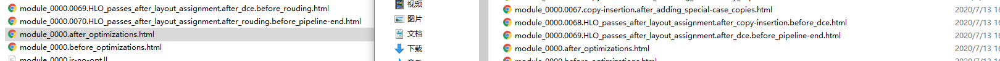
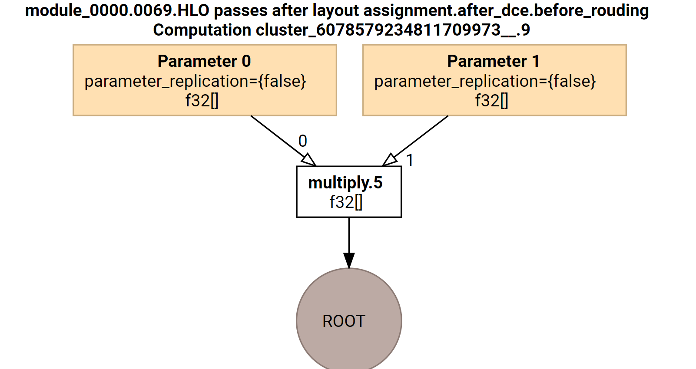
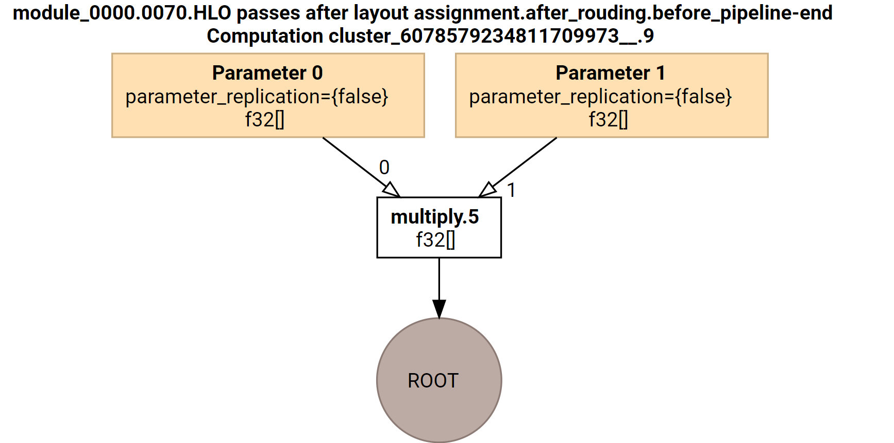

# 编译添加pass的源码


## 检测
在新建的pass中添加的输出语句

`  VLOG(2) << "Before rouding_simplification:";`

`VLOG(2) << "After rouding_simplification:";`

将pass的每个步骤输出

```
os.environ["TF_XLA_FLAGS"] = "--tf_xla_auto_jit=2"
os.environ["XLA_FLAGS"] = "--xla_dump_to=/mnt/d/pass --xla_dump_hlo_pass_re=.* --xla_dump_hlo_as_html"
```

查看图



比之前多了一个pass




图中可以看到输出

## 对instruction与computation的操作

